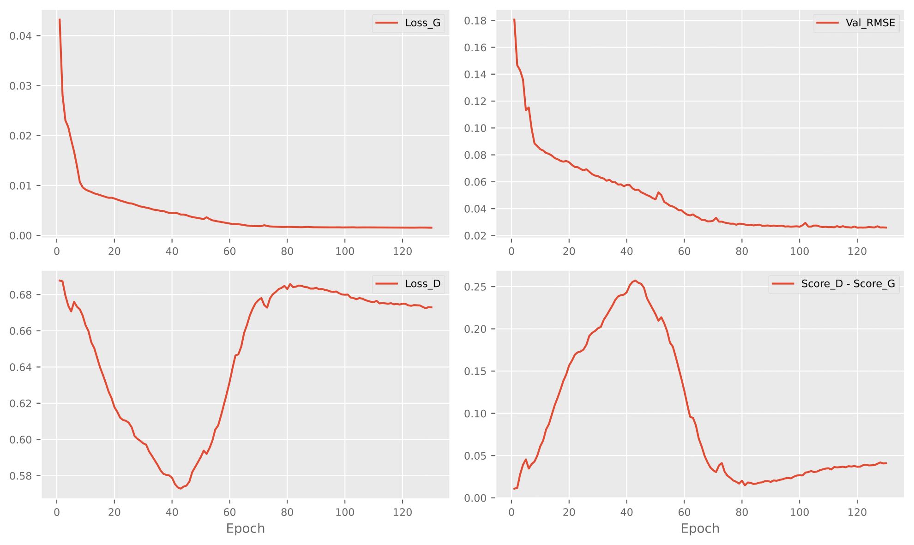
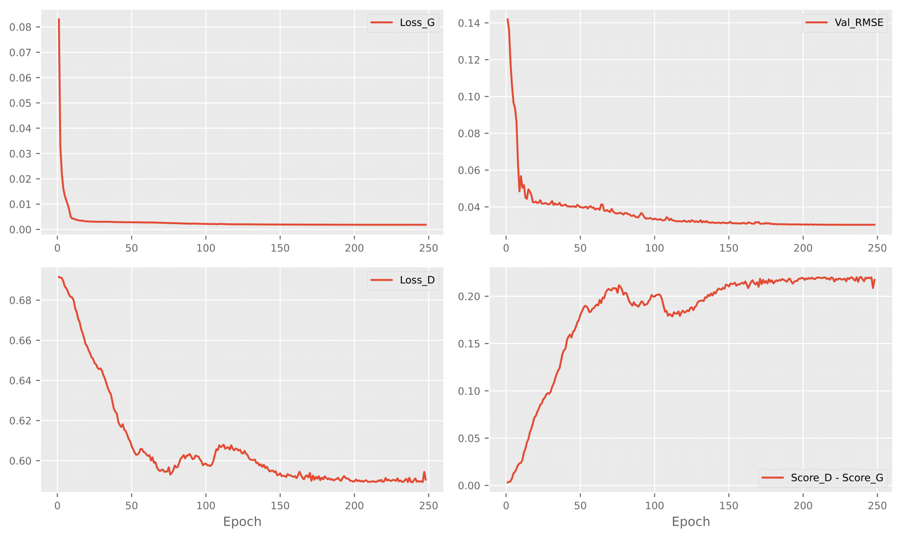

# Project Tree
```
UNet-Gan
├─ .gitignore
├─ LICENSE
├─ README.md
├─ bound
│  ├─ lancang_0.1.nc
│  ├─ yangtze_0.1.nc
│  └─ yellow_0.1.nc
├─ finetune_amsmqtp.py
├─ loss.py
├─ model.py
├─ models
│  ├─ MBConv_UNet.py
│  ├─ UNet.py
├─ parameter_search.txt
├─ plot
│  ├─ finetune.pdf
│  ├─ pretrain.pdf
│  └─ taylor.pdf
├─ plot_src
│  ├─ plot_test_metric.ipynb
│  └─ plot_train_curve.ipynb
├─ pretrain_era5.py
├─ scripts
│  ├─ finetune
│  │  └─ UNet.sh
│  ├─ inference
│  │  ├─ UNet.sh
│  │  └─ history.sh
│  └─ pretrain
│     ├─ MBConvUNet.sh
│     └─ UNet.sh
├─ unet-gan.yml
└─ utils
   └─ tools.py
```
# Loss Curve
## Pretrain

## Finetune

# Dependency
Install Python 3.10. For convenience, execute the following command.
```bash
conda env create -f unetgan.yml
```
# Scripts
## Pretrain
```bash
bash scripts/pretrain/UNet.sh
```
## Finetune
```bash
bash scripts/finetune/UNet.sh
```
## Inference
```bash
bash scripts/inference/UNet.sh
bash scripts/inference/history.sh
```
# Parameter adjustment results
```
./parameter_search.txt
```